# SHOP-365


## Overview

This is a fullstack ecommerce application site  enables users to shop for their clothing, jewellery and electronic needs online. The tech stack for the frontend part of the application consists of ReactJS, Material UI and a host of other NPM packages. The backend is powered by supabase. This app allows users to carry out shopping online and allows authenticated and authorized managers to post new products to a protected url endpoint which serves as an admin dashboard.


## Table of Contents

* [Description](#description)

* [Usage](#usage)

* [Deployment](#deployment)

* [Technologies](#technologies)

* [License](#license)

* [Collaborators](#collaborators)

* [Screenshots](#screenshots)

* [Tests](#tests)

* [Questions](#questions)

## Description

The app consists of a Navbar containing multiple links, company logo and a shopping cart icon. The Navbar also contains a search bar which allows users to carry out a search of products available on the site. Immediately below the Navbar, is the products page or homepage. In this section, users are able to see all the available products on offer. Each product contains two buttons, a add to cart button and a product detail button. Other sections of the app are the product detail page, the cart page, the order confirmation component, the contact us page as well as a FAQ page. Also, there is a footer which contains links, addresses and social media links.

## Usage

```
This is an ecommerce application that enables users to shop for items online at the site. When users open the site, they are presented with the home page and are able to see all the available items on offer. Users can then directly add any item of their choice to their cart via a button on each item or go to the product detils page where they are presented with detailed information about the product including its description and rating. In that page, they can also add the product to thier cart if they wish. After they are through with browsing products and selecting products that they want, they can they take a look at their cart by pressing the cart icon. This  takes them to the cart page, where they can see all the items they have selected and the total cost. They can then delete an item or checkout. On pressing the checkout button they are presented with a popup element which shows them their order details including total price. They are then prompted to confirm their purchase. If they confirm their purchase,  the cart is cleared and they are redirected back to the homepage.
```

## Deployment

[](https://app.netlify.com/sites/shop-365/deploys)

The site is deployed at the following url https://shop-365.netlify.app/


## Technologies

* REACT JS
* SUPABASE
* MATERIAL UI
* REACT LAZY LOAD
* REACT ROUTER DOM 

## License

* Source code is licensed under the .
* Read the fine print of [MIT license](./license)

## Collaborators

This project was built by
* [Alex Ainslie](https://github.com/AlexAins)
* [Zee Mudia](https://github.com/iosazee)
* [Mike Davies](https://github.com/welsh-bloke)

We worked in an agile manner to deliver this project over a sprint of ten days. At the very outset, we held a team meeting to decide what we wanted to build. In that meeting we also decided what features we would like our app to have and their prorities. We defined what the minimum viable product(MVP) will be. In Over the cousrse of the sprint we held daily standups always of no more than fifteen minutes where we were guided by three questions, where we are at the moment, where we would like to be and any blockers, if any was preventing us from reaching where we ought to be(if we haven't reached there yet). We also divided the work amongst ourseves and to keep track of our progress we made effective use of github's project management tools like the Kanban board where every member of the team could see at a glance the state of the project.
<div display="flex" align="center" >
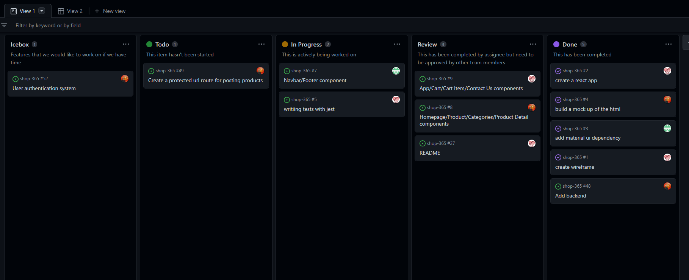
</div>

We also used charts to track the status of our work.
<div align="center" >
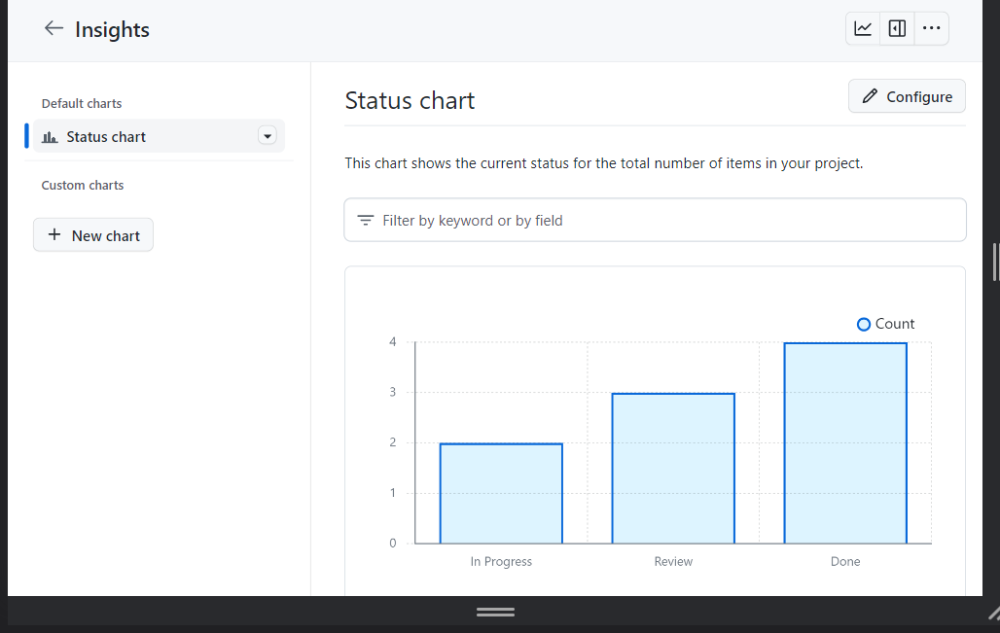
</div>

One of our very first task was to design our application wireframe so that we could visualize what the app will look like. We used figma to create these basic wireframes.
<div align="center">
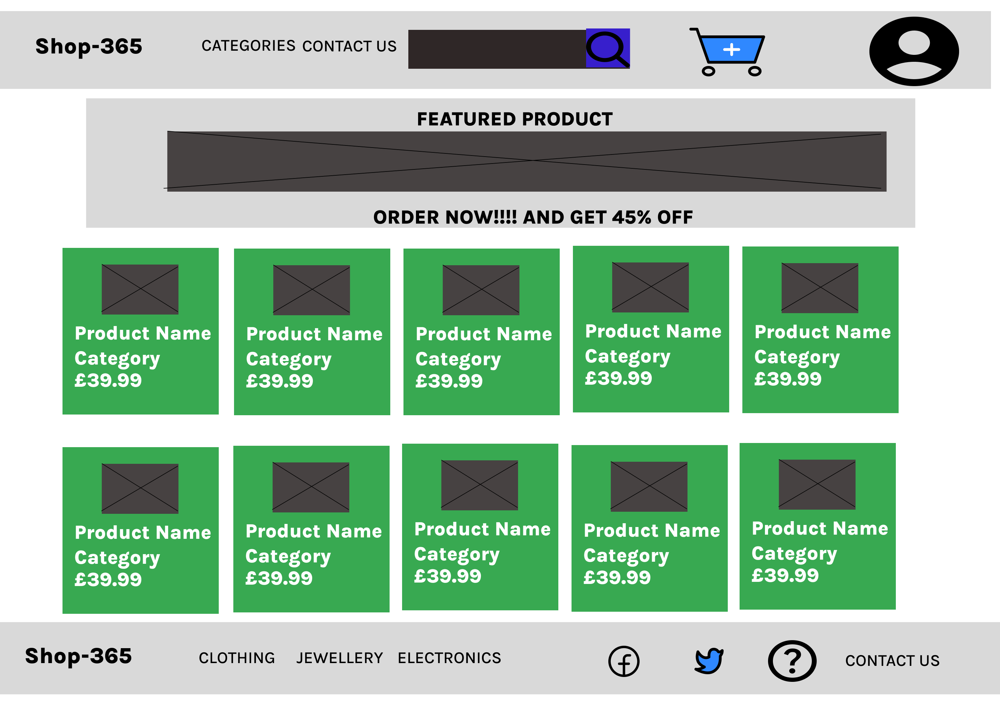
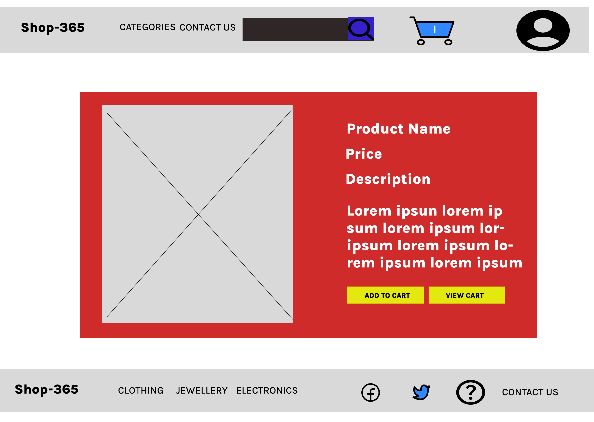
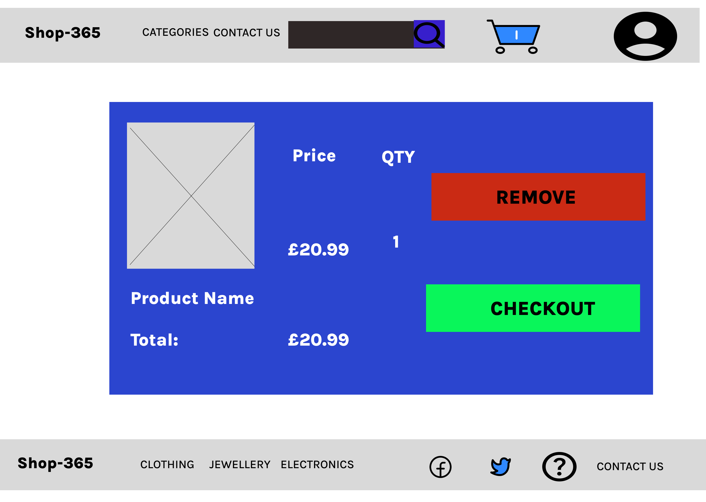
</div>

## Screenshots

A user journey through our app:
<div align="center">
    <div display="flex">
        <div display="flex" flex-direction="column">
            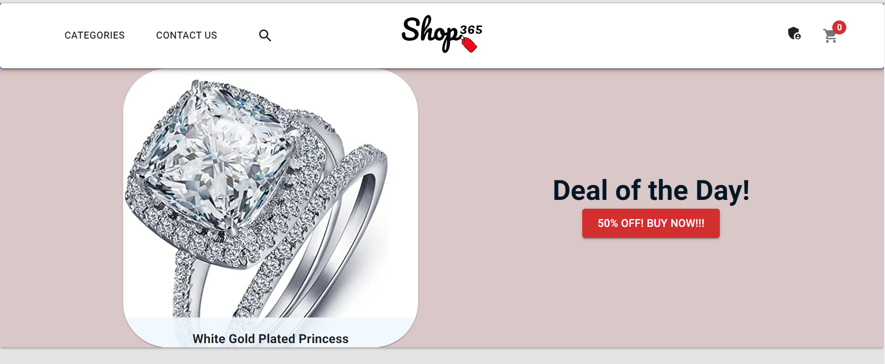
            <p>NAVBAR AND FEATURED PRODUCT</p>
        </div>
    <div display="flex" flex-direction="column">
        <div>
            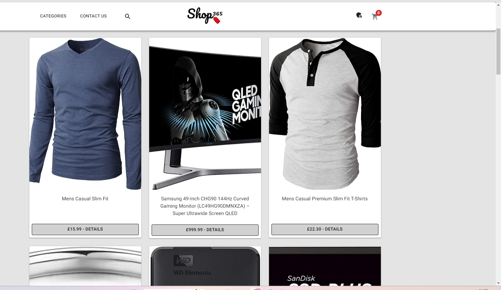
            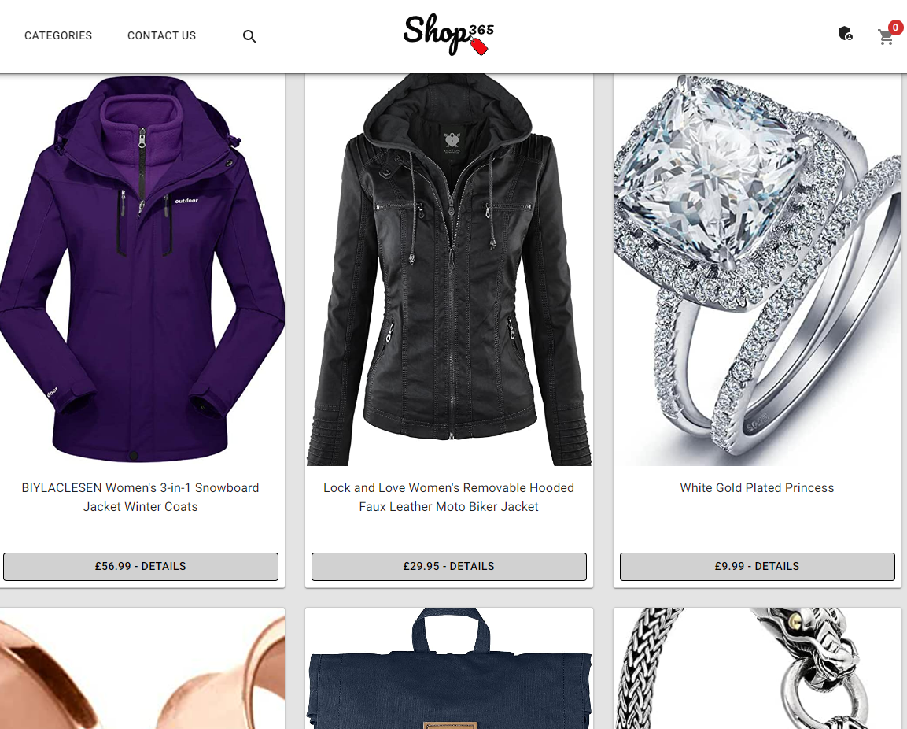
            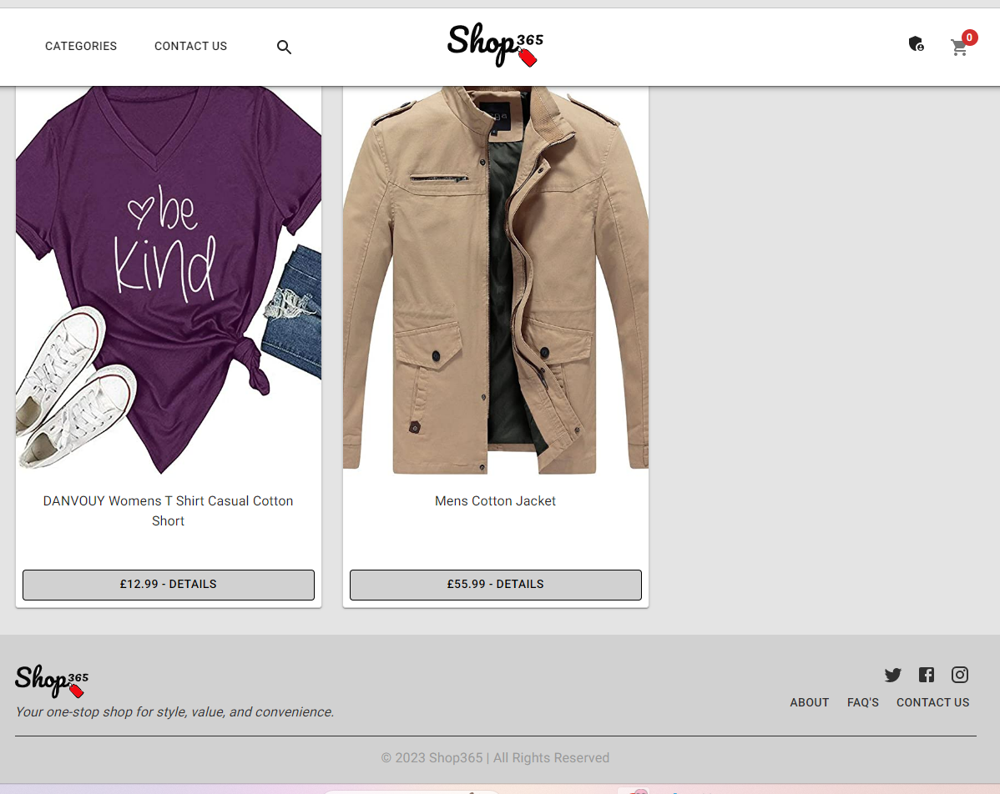
        </div>
        <p>Products Section and Footer</p>
        </div>
    </div>
    <div display="flex" flex-direction="column">
        <div>
            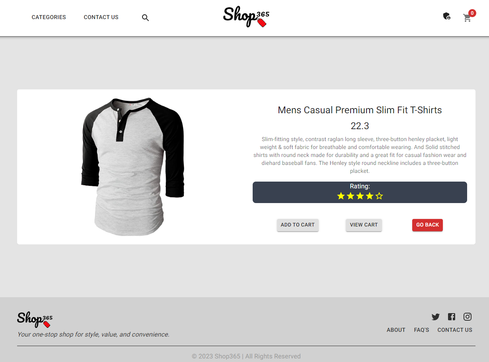
            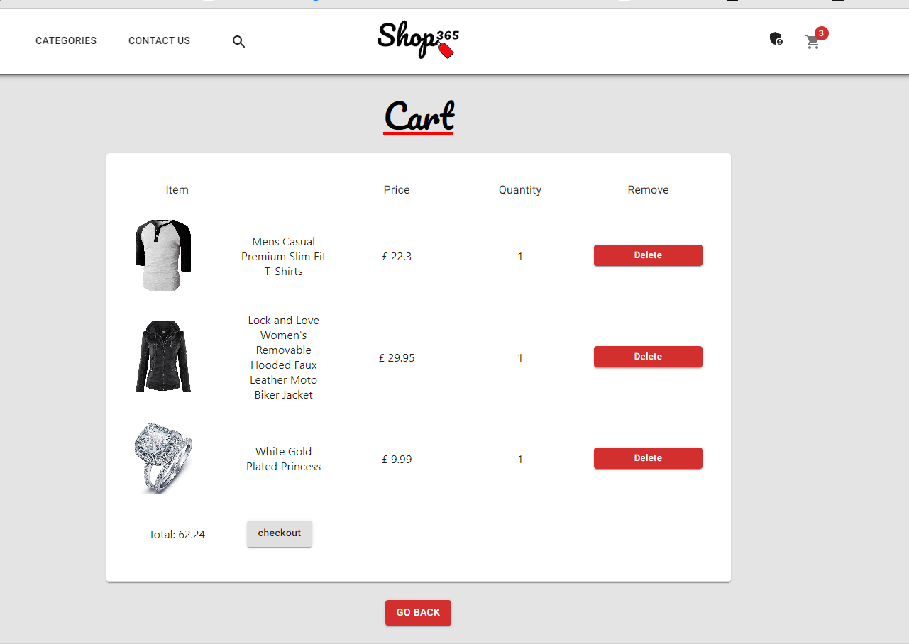
            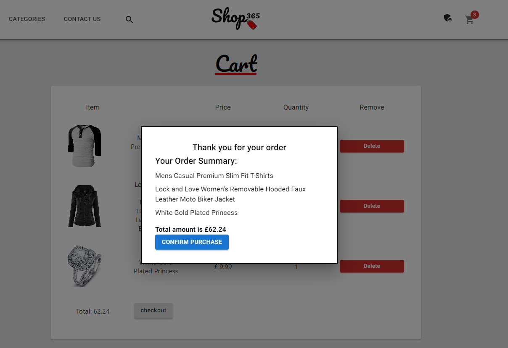
        </div>
        <p>Product Detail. Cart, and Order Confirmation Popup Sections</p>
    </div>
    <div display="flex" flex-direction="column">
        <div>
            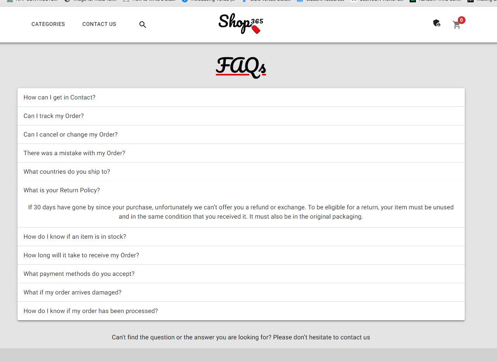
            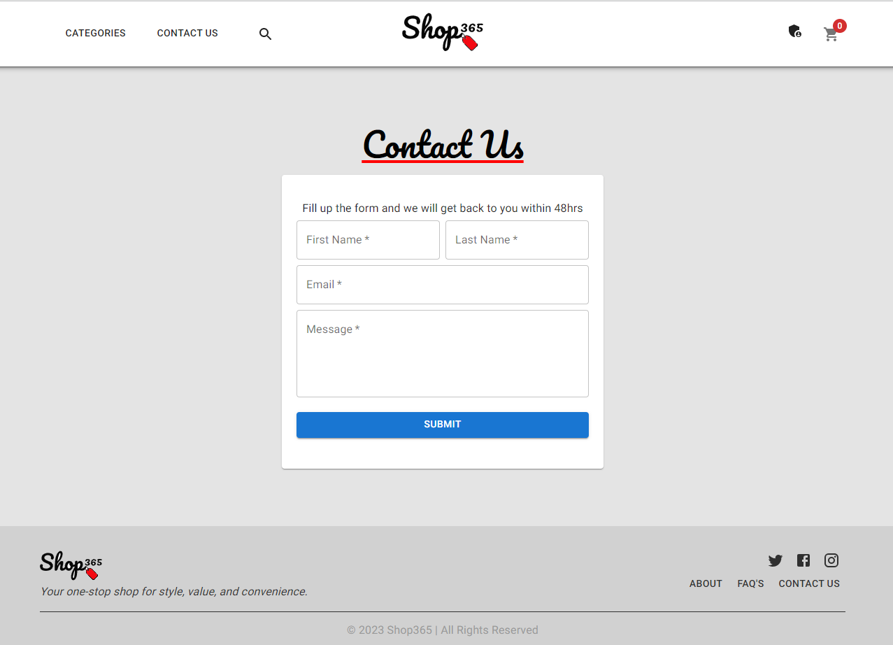
        </div>
        <p>FAQs and Contact Us Sections</p>
        </div>
    </div>
</div>


## Tests

```
Run the command "npm run test" to run the tests which test for behavior of different components of the app.
```

## Questions

If you have any questions you can contact us via email at [Zee](iosazee1@gmail.com), [Alex](alex.ainslie99@gmail.com) and [Mike](Mike@originet.co.uk)

You can see more of our work on our github profiles [Alex](https://github.com/AlexAins), [Mike](https://github.com/welsh-bloke) and [Zee](https://github.com/iosazee).


<font size="1">This README was generated by [README-Generator](https://github.com/iosazee/README-Generator)</font>
